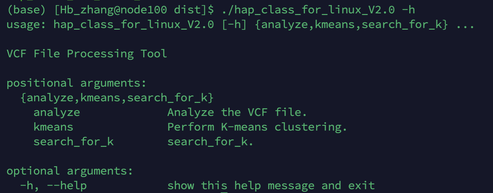
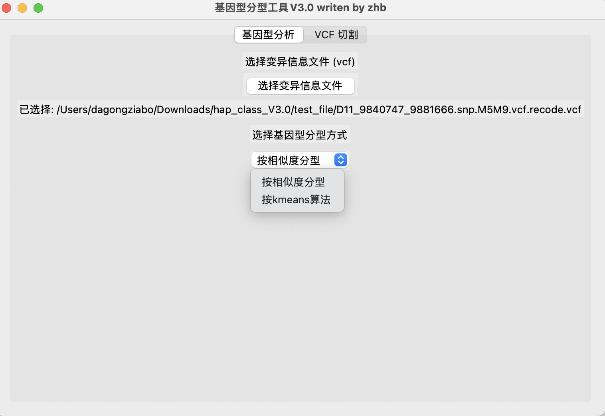
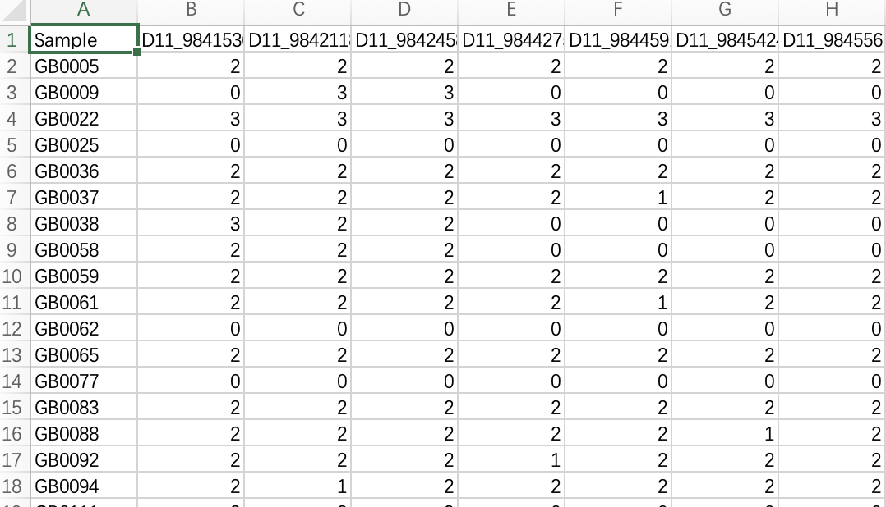
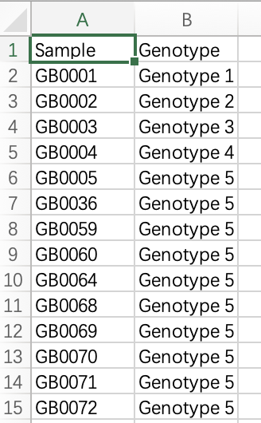
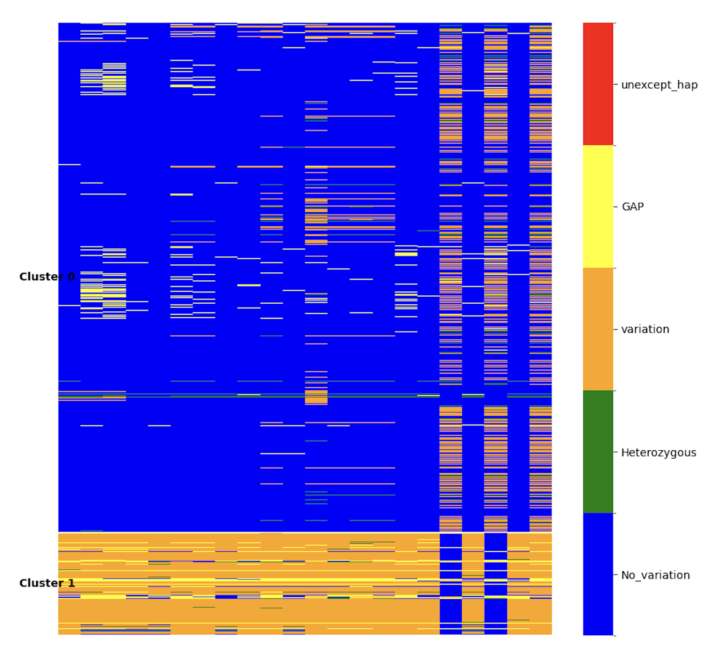
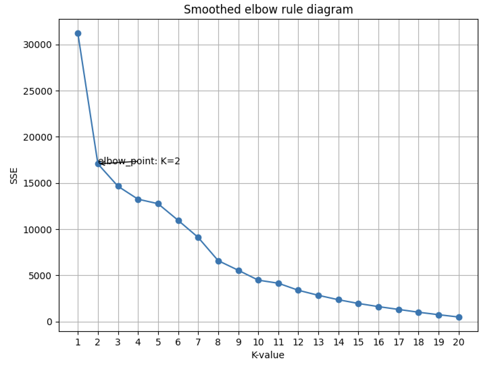
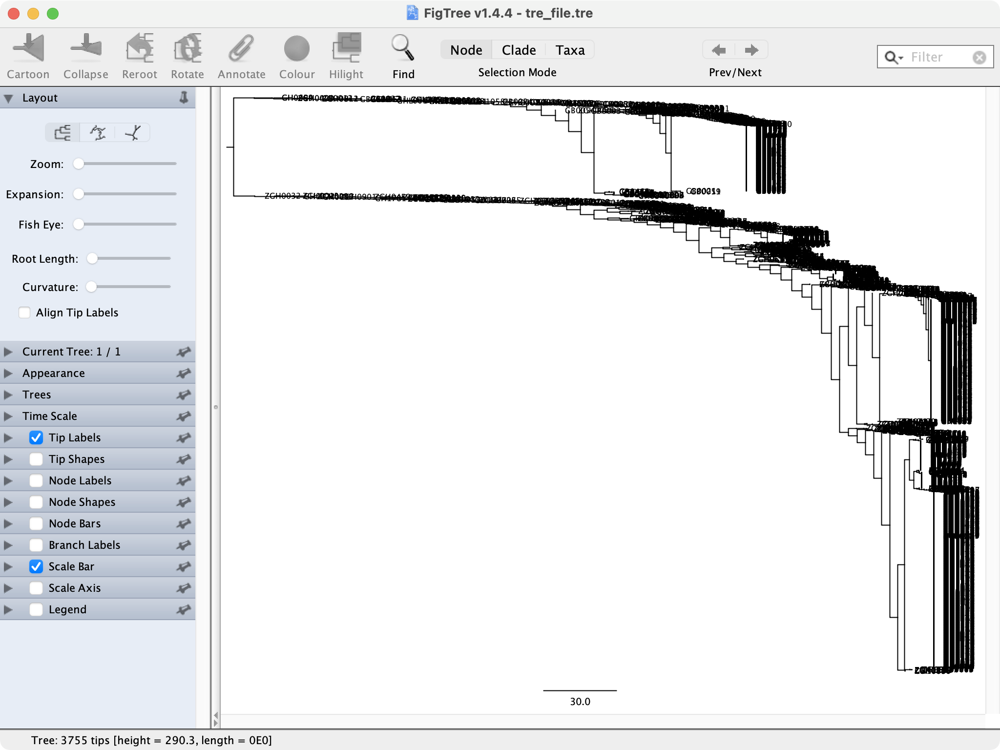

# hap_class README

code by zhanghaobo

written in 2024.11

hap_class 能够根据片段SNP对材料分进行分型、分类。该软件是基于python编写的一个跨平台的”低“分辨率的基因型分型软件。


## 安装说明

为整包免编译软件。为了方便大家使用未部署数字签名。

#### MAC（M芯片版本）版本

下载完成后在 【系统设置/隐私与安全/安全性 】中打开App Store和被认可的开发者。

双击下载的软件（部分版本MAC可能需要再在【系统设置/隐私与安全/安全性 】允许打开。）

#### linux版本

下载完成后，./hap_class_for_linux_V2.0 [argements]即可运行，下图为正常运行状态



## 主要参数说明

### Mac版本

需要提供数据：VCF文件

MAC版本目前两大模块

#### VCF文件切割（SNP提取模块）：

可以根据SNP的分布位置、材料等因素对SNP进行提取，但建议只进行轻量量化工作，或者验证亚群基因型的提取

#### 基因型分型模块

提供两种算法

##### 相似分型法

该算法采用全局比对材料之间的相似程度（将SNP进行逐一比对），根据相似程度对材料进行分型

需要提供一个基因型允许的最大的误差程度，以及绘图时候最小基因型展示的材料数

##### 层次聚类基因型分型方法

该算法采用非监督机器学习的方式，利用search_for_k大体确定一个基因型的数目，然后咱们人工判断审核后，确定k值进行人工层次聚类。

#### mac版本的图形操作界面展示




### linux版本

提供analyze、kmeans、search_for_k参数。

#### 相似分型法（analyze参数）

​	将SNP进行逐一比对，将序列相似的材料分为一组。为较常用的基因型分型手段。但是耗时较长。

```sh
[analyze]
  -h, --help            show this help message and exit
  -f VCF_FILE, --vcf_file VCF_FILE
                        Path to the input VCF file.
  -t THRESHOLD, --threshold THRESHOLD
                        Threshold for analysis.
  -s SHOW_NUM, --show_num SHOW_NUM
                        Number of results to show.
  -o OUTPUT_FILE_PATH, --output_file_path OUTPUT_FILE_PATH
                        path to the output heatmap file.
  -p HEATMAP_FILE_PATH, --heatmap_file_path HEATMAP_FILE_PATH
                        path to the output heatmap.
  -a OUTPUT_HEATMAP_FILE_PATH, --output_heatmap_file_path OUTPUT_HEATMAP_FILE_PATH
                        path to the output heatmap.
```


#### 层次聚类基因型分型方法（kmeans、search_for_k参数）

​	利用层次聚类建树的方法对基因型进行分型

​	search_for_k的参数为进行基因型分型的亚型的数目提出建议。

```sh
[search_for_k]
  -h, --help            show this help message and exit
  -f VCF_FILE_PATH, --vcf_file_path VCF_FILE_PATH
                        Path to the input VCF file.
  -p ELBOW_POINT_PLOT_PATH, --elbow_point_plot_path ELBOW_POINT_PLOT_PATH
                        path to the output elbow_point_plot_path.
                        
[kmeans]
  -h, --help            show this help message and exit
  -f VCF_FILE, --vcf_file VCF_FILE
                        Path to the input VCF file.
  -k K_VALUE, --k_value K_VALUE
                        Number of clusters (k).
  -p HEATMAP_FILE_PATH, --heatmap_file_path HEATMAP_FILE_PATH
                        path to the output heatmap.
  -t TRE_FILE_PATH, --tre_file_path TRE_FILE_PATH
                        path to the output tre_file.
  -c CLUSTERING_RESULTS_FILE_PATH, --clustering_results_file_path CLUSTERING_RESULTS_FILE_PATH
                        path to the output clustering_results.
```


## 结果展示

基因型分型 并且自动识别出所在基因型、用kmeans的话能够展示出对应的tre结果




热图绘制文件（为之后自定义绘图准备）


=======


基因型分型结果



plot_k文件（该文件定义来帮助我们确定k值）



tre文件（确定材料间亲缘关系，在层次聚类中才有，相似比对法中不存在）


热图绘制文件（为之后自定义绘图准备）


基因型分型结果文件


